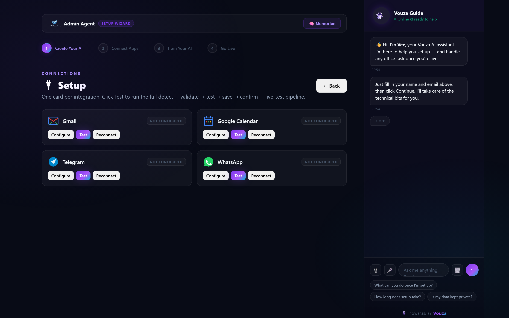
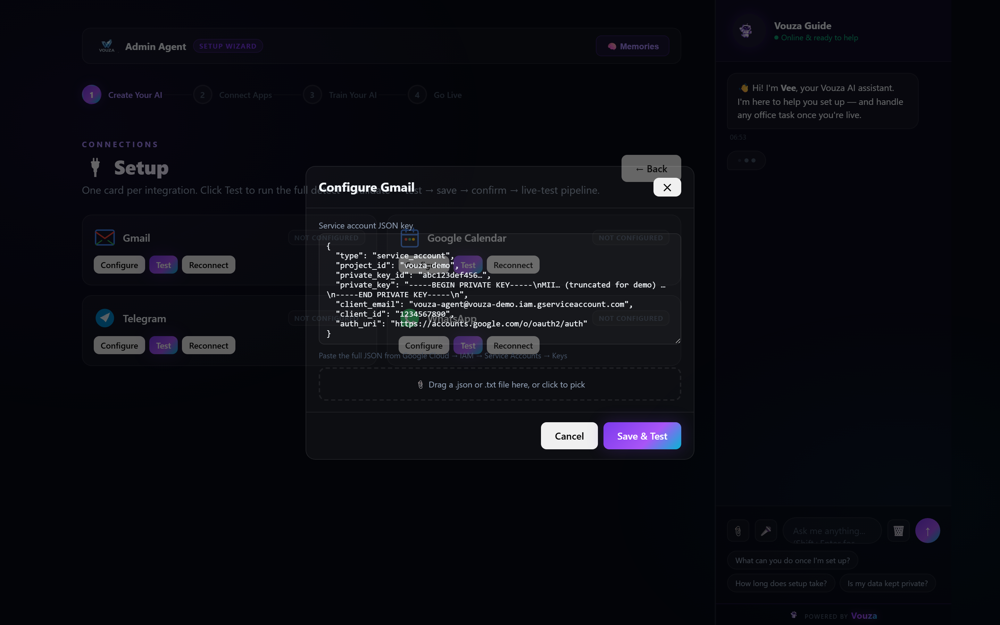
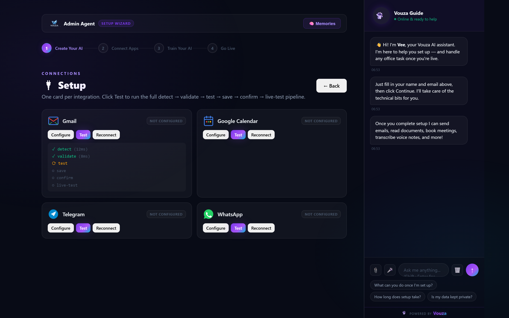

<div align="center">

# Vouza Admin Agent

**Your AI office assistant — runs on your PC, controlled from your phone.**

Email · Calendar · WhatsApp · Telegram · Files · Voice · Web search — all in one agent.

[](#)
[](https://nodejs.org)
[](#)
[](#)

[Quickstart](#-quickstart) · [Features](#-features) · [Connect Channels](#-connect-channels) · [Run 24/7](#%EF%B8%8F-running-247) · [Updating](#-updating) · [Troubleshooting](#-troubleshooting)

</div>

<p align="center">
  
</p>

> *Per-integration cards with self-healing `detect → validate → test → save → confirm → live-test` pipeline. Click Test, watch each step succeed live.*

---

## ✨ Features

- 🧠 **Multi-provider AI** — Anthropic, OpenAI, Gemini, DeepSeek, xAI, OpenRouter (100+ models). One key, automatic failover.
- 📬 **Email + Calendar** — Gmail (App Password or Service Account), Google Calendar, dedicated AgentMail inbox.
- 💬 **Two-way messaging** — Telegram bot, WhatsApp (native QR via Baileys, no Docker required), Slack (Bolt SDK — coming).
- 🔧 **Self-healing setup** — structured `detect → validate → test → save → confirm → live-test` pipeline replaces ad-hoc retries.
- 📊 **Observability built-in** — per-integration p50/p95 latency, retry counts, webhook log, failed-action retry, API spend tracking.
- 🔌 **Visual setup wizard** — per-integration cards with Configure / Test / Reconnect buttons + step-by-step progress UI.
- 🎙️ **Voice notes** — drop a `.mp3`/`.ogg` into chat, Whisper transcribes via Groq or OpenAI.
- 🛡️ **Secure by default** — loopback-only dashboard, PDPA-compliant audit log, secret redaction, sandboxed file ops.

---

## ⚡ Quickstart

> **Pick ONE** install method. They're equivalent — just different convenience layers.

<table>
<tr>
<td width="33%" valign="top">

### 🐳 Docker
**Best for: servers, VPS, "set & forget"**

```bash
git clone https://github.com/geechun80/vouza-admin-agent.git
cd vouza-admin-agent
cp .env.example .env
# Edit .env: set VOUZA_API_KEY
docker compose up -d
```

Open **http://localhost:3456**

No Node, no PM2, auto-restart, survives reboots.

</td>
<td width="33%" valign="top">

### 💻 Native Node
**Best for: development, customization**

```bash
git clone https://github.com/geechun80/vouza-admin-agent.git
cd vouza-admin-agent
npm install
npm run build
node dist/dashboard/launch.js
```

Open **http://localhost:3456**

Requires [Node.js 20.19+](https://nodejs.org).

</td>
<td width="33%" valign="top">

### 🪟 Windows one-click
**Best for: non-technical users**

After cloning + `npm install` + `npm run build`:

1. Double-click **`start.bat`**
2. Browser opens to wizard
3. Done

For 24/7 background: double-click **`install-autostart.bat`** (uses Task Scheduler).

</td>
</tr>
</table>

### 🔑 Get your AI key

You only need **one**. Paste it directly into the Setup Wizard — no file editing.

| Provider | Get a key | Format |
|---|---|---|
| **Anthropic** Claude | [console.anthropic.com/keys](https://console.anthropic.com/keys) | `sk-ant-…` |
| **OpenAI** GPT-4o | [platform.openai.com/api-keys](https://platform.openai.com/api-keys) | `sk-proj-…` |
| **Google** Gemini | [aistudio.google.com/app/apikey](https://aistudio.google.com/app/apikey) | `AIza…` |
| **OpenRouter** *100+ models, one key* | [openrouter.ai/keys](https://openrouter.ai/keys) | `sk-or-…` |
| DeepSeek / xAI / Groq | See respective console | — |

> 💡 **OpenRouter recommended** if you want to try different models without managing multiple keys.

---

## 🔌 Connect Channels

After the wizard, use the **🔌 Setup** panel in the dashboard to connect channels. Each integration goes through a guided pipeline that tests credentials live before saving — no more "saved but doesn't work."

<p align="center">
  
</p>

<p align="center">
  
</p>

> *Paste the credential JSON or drag the `.json` file in — the pipeline runs each step live so you see exactly where any failure happens, with a specific suggested fix.*

<details>
<summary><b>📱 Telegram</b> (recommended — control your agent from your phone)</summary>

1. On Telegram, message **[@BotFather](https://t.me/BotFather)** → send `/newbot`
2. Choose a name + username → copy the **bot token**
3. Dashboard → **🔌 Setup** → Telegram → Configure → paste token → **Test**
4. Message your bot — it replies via the agent

</details>

<details>
<summary><b>💚 WhatsApp</b> (free, no Docker, no Twilio)</summary>

1. Dashboard → **🔌 Setup** → WhatsApp → **Connect** — QR code appears
2. On your phone: WhatsApp → ⋮ Menu → **Linked Devices → Link a Device**
3. Scan the QR
4. Done — messages from your allowlist route through the agent

> By default, only YOUR number can interact with the agent (deny-by-default allowlist). Add others in Settings → WhatsApp.

</details>

<details>
<summary><b>📧 Gmail</b> (send & receive email)</summary>

**Option A — App Password (simplest):**
1. Enable [2-Step Verification](https://myaccount.google.com/signinoptions/twosvauth)
2. Go to [App Passwords](https://myaccount.google.com/apppasswords) → create one for "Mail"
3. Dashboard → **🔌 Setup** → Gmail → paste 16-char password

**Option B — Service Account (recommended for teams):**
1. [GCP Console → Service Accounts](https://console.cloud.google.com/iam-admin/serviceaccounts) → create one
2. Generate a JSON key → download
3. [Enable Gmail API](https://console.cloud.google.com/apis/library/gmail.googleapis.com)
4. Dashboard → **🔌 Setup** → Gmail → drag the `.json` file into the modal

</details>

<details>
<summary><b>📅 Google Calendar</b></summary>

1. [GCP Console → Service Accounts](https://console.cloud.google.com/iam-admin/serviceaccounts) → create one + JSON key
2. [Enable Calendar API](https://console.cloud.google.com/apis/library/calendar-json.googleapis.com)
3. Share your calendar with the service account's email (the `client_email` field)
4. Dashboard → **🔌 Setup** → Google Calendar → drop the `.json` file

</details>

<details>
<summary><b>📨 AgentMail</b> (dedicated AI inbox)</summary>

1. Sign up at [agentmail.to](https://agentmail.to) → get an API key
2. Dashboard → **🔌 Setup** → AgentMail → paste key
3. The agent creates an inbox like `your-agent@agentmail.to` and polls it every 60s

</details>

---

## 🛠️ Running 24/7

For "always running" deployments — survives reboots, restarts on crash.

<table>
<tr>
<td width="50%" valign="top">

### 🪟 Windows — Task Scheduler
**No extra tools needed.**

```cmd
install-autostart.bat
```

Answer **Y** twice. Agent starts now and on every login.

**To remove:** `uninstall-autostart.bat`

</td>
<td width="50%" valign="top">

### 🐧 Mac / Linux / Cross-platform — PM2
**Live logs + CPU/memory monitoring.**

```bash
# Windows
install-pm2.bat

# Mac / Linux
chmod +x install-pm2.sh
./install-pm2.sh
```

Script installs PM2, builds, starts, persists.

</td>
</tr>
</table>

<details>
<summary><b>Daily PM2 commands</b></summary>

| Command | Purpose |
|---|---|
| `pm2 list` | Show agent status / CPU / memory |
| `pm2 logs admin-agent` | Tail live logs |
| `pm2 monit` | Real-time dashboard |
| `pm2 restart admin-agent` | Restart after update |
| `pm2 stop admin-agent` | Stop |
| `pm2 flush admin-agent` | Clear log files |

</details>

<details>
<summary><b>Daily Docker commands</b></summary>

| Command | Purpose |
|---|---|
| `docker compose up -d` | Start in background |
| `docker compose logs -f` | Tail logs |
| `docker compose restart admin-agent` | Restart |
| `docker compose down` | Stop |
| `docker compose ps` | Show containers |

</details>

---

## 🔄 Updating

> Your `data/` directory (config, credentials, chat history, WhatsApp auth) is **never touched** by an update.

### Easiest

| OS | Action |
|---|---|
| **Windows** | Double-click `update.bat` |
| **Mac / Linux** | `./update.sh` |
| **Docker** | `git pull && docker compose up -d --build` |

### Manual

```bash
cd vouza-admin-agent
git pull
npm ci            # ← exact pinned versions (NOT npm install)
npm run build
pm2 restart admin-agent
```

> ⚠️ **Always use `npm ci`, not `npm install`.** `npm ci` reads `package-lock.json` exactly. `npm install` can silently upgrade pinned deps (Baileys, Playwright) and break things.

### Verify the update worked

1. Open **http://localhost:3456** — "What's new" modal appears once
2. Send a test message to the Guide Bot — replies appear at the **bottom** of chat
3. Check `data/logs/admin-agent.log` — fresh JSON entries from the current minute

---

## 🧪 Troubleshooting

| Symptom | Fix |
|---|---|
| `Port 3456 already in use` | `npx kill-port 3456` or close the other instance |
| `Cannot find module` | `npm run build` again |
| Telegram bot silent | Verify the bot token via **@BotFather** → `/mybots` |
| WhatsApp "Invalid QR code" | Dashboard → Setup → WhatsApp → **Reset & start fresh** button |
| WhatsApp disconnects often | Phone needs internet; check the same phone isn't linked elsewhere |
| `pm2: command not found` | Reopen terminal, or `npm config get prefix` and add to PATH |
| PM2 won't auto-start on Windows | `pm2 startup` doesn't work on Windows — use `install-autostart.bat` |
| Agent crash-loops | `pm2 logs admin-agent --lines 50` — usually missing `data/config.json` (finish the wizard) |
| Bot replies above user message | You're on an old build — `git pull && npm ci && npm run build` |

<details>
<summary><b>More PM2 troubleshooting</b></summary>

| Symptom | Cause | Fix |
|---|---|---|
| `EACCES: permission denied` during install | Need elevation | **Win**: run as Admin · **Mac/Linux**: prefix `sudo` |
| Memory grows past 500 MB | Normal up to ~500 MB | PM2 auto-restarts past 500 MB (configured in `ecosystem.config.cjs`) |
| `npm install -g pm2` blocked by proxy | Corporate network | `npm config set proxy http://your.proxy:8080` |
| `npm install -g pm2` blocked by antivirus | Windows Defender flagging | Temp-disable real-time protection, install, re-enable |

</details>

---

## 🏗️ Architecture

```
src/
  agent/          → loop, redactor, error classifier, budget, failover
  orchestrator/   → self-healing pipeline (detect → validate → test → save → confirm → live-test)
  integrations/   → unified Integration interface + HealthMonitor (rolling 1000-event window)
  bridge/         → service manager + circuit breakers
  config/         → wizard config → runtime AgentContext
  dashboard/      → Express API + single-page UI (Setup panel, Health dashboard)
  email/          → AgentMail listener
  telegram/       → polling + webhook, live streaming, inline keyboards
  whatsapp/       → Baileys (native QR) + WAHA (webhook)
  tools/          → 27+ tools: email, calendar, sheets, files, voice, web search, …
  voice/          → Whisper via Groq / OpenAI
```

Key patterns documented in `memory/build_rules_agents.md` — 63 rules covering everything from listener structure to credential validation pipelines.

---

## 📚 Documentation

- **[API Reference](docs/api-reference.md)** — HTTP endpoints, SSE events, auth
- **[Architecture Deep-Dive](docs/architecture.md)** — Agent loop, orchestrator, integrations, security model
- **[Customization Guide](docs/customization.md)** — Add tools, MCP servers, custom skills, branding

---

## 📜 License & Support

Private repo — contact the Vouza team for access or to report issues.

Built with ❤️ by [Vouza.ai](https://vouza.ai) — Singapore.
