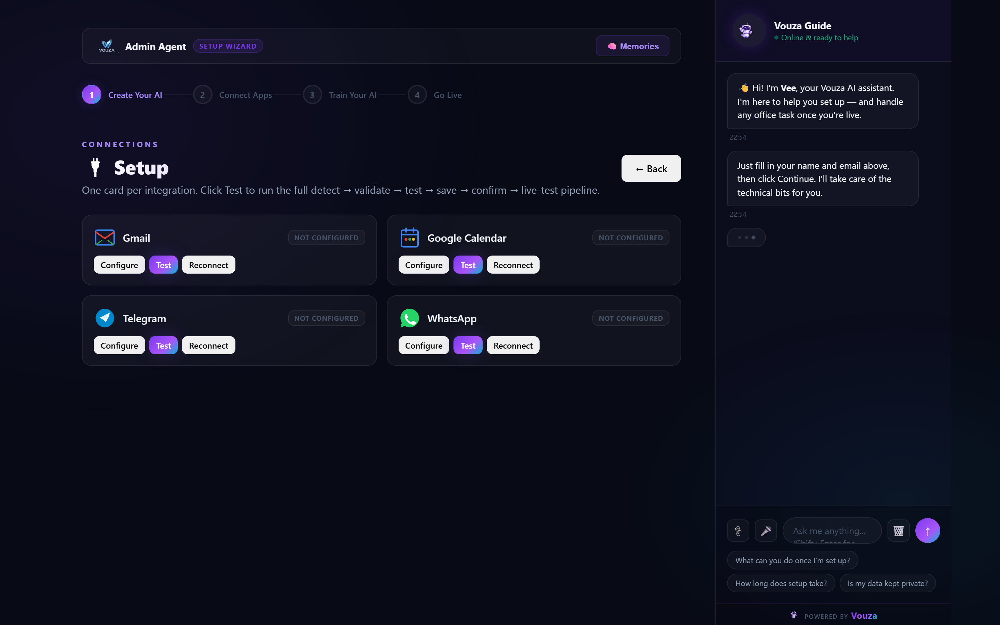
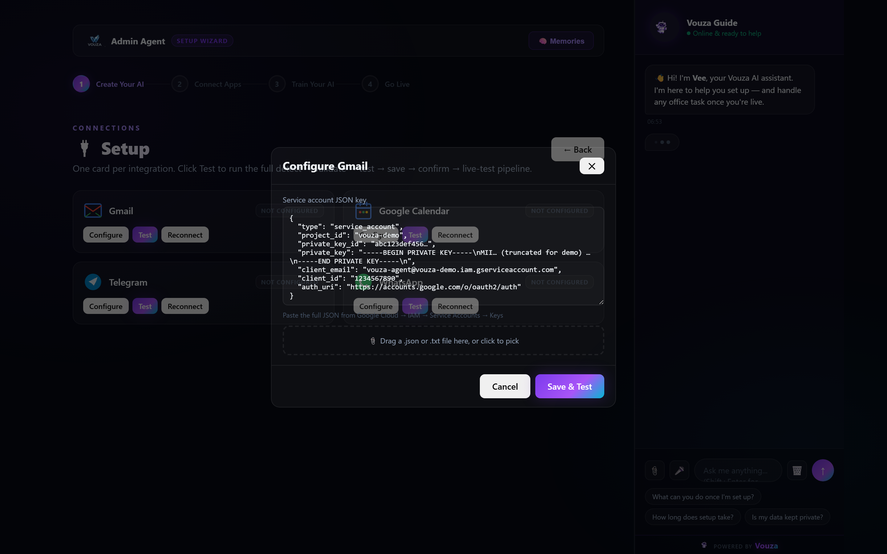
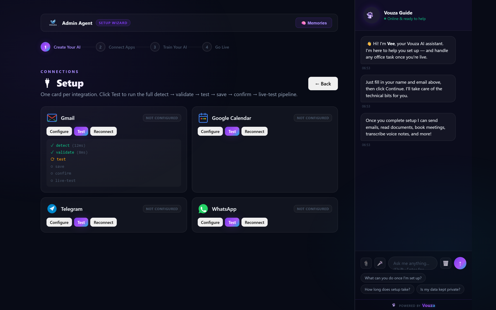

<div align="center">

# Vouza Admin Agent

**Your AI office assistant — runs on your PC, controlled from your phone.**

Reads and answers email · finds your documents · checks your calendar · works from WhatsApp or Telegram

**Latest version: 2.2.2** · [What's new](CHANGELOG.md)

[](#)
[](https://nodejs.org)
[](#)

[Install](#%EF%B8%8F-install) · [Update](#-update) · [Uninstall](#%EF%B8%8F-uninstall) · [First-time setup](#-first-time-setup) · [Phone](#-using-it-from-your-phone) · [Safety](#%EF%B8%8F-safety-defaults) · [Troubleshooting](#-troubleshooting)

</div>

<p align="center">
  
</p>

---

## ✨ What it does

- 🚀 **Five-minute setup** — paste one AI key, type your email, scan a QR code with your phone. No config files.
- 📱 **Works from your phone** — message it on WhatsApp or Telegram; it finds a document and sends you the file. It always asks **YES** before sending an email.
- 🔒 **Private by default** — runs on your computer, keys and passwords are encrypted, and it only goes online when you ask.
- 🧠 **Any AI** — Claude, ChatGPT, Gemini, Grok, DeepSeek, Qwen, Kimi or 400+ models through one OpenRouter key — or a local AI on your own computer.

---

## ⬇️ Install

### Windows (recommended — no technical skills needed)

1. Install **[Node.js](https://nodejs.org)** — click the **LTS** button (version 20.19 or newer) and run the installer.
2. Download this project: click the green **Code** button above → **Download ZIP**, then unzip it somewhere easy, e.g. `Documents\Vouza Admin Agent`.
   *(Using git? `git clone https://github.com/geechun80/vouza-admin-agent.git` instead.)*
3. Open the folder and double-click **`start.bat`**. The first start installs what's needed (1–2 minutes), then your browser opens. Press **Get Started**.

Keep the black window open (minimised) — the assistant runs while it's open. To start it automatically when Windows starts, double-click **`install-autostart.bat`**.

### Mac / Linux

```bash
git clone https://github.com/geechun80/vouza-admin-agent.git
cd vouza-admin-agent
npm ci
npm run setup
```

Then open **http://localhost:3456**. Needs [Node.js 20.19+](https://nodejs.org).

### Docker (an always-on PC or home server)

```bash
git clone https://github.com/geechun80/vouza-admin-agent.git
cd vouza-admin-agent
docker compose up -d --build
```

Then open **http://localhost:3456** on that computer. For safety it isn't reachable from other devices; use an SSH tunnel or Tailscale for remote access.

---

## 🔄 Update

**Which version am I on?** The dashboard shows it on the start screen, in the sidebar and in **System Health**, with a **Check for updates** button — and it shows a banner by itself when a new version is out. The latest version is shown at the top of this page.

| How you installed | How to update |
|---|---|
| **Windows, with git** (you cloned it) | Double-click **`update.bat`** |
| **Windows, from a ZIP download** | Download the new ZIP and unzip it to a **new** folder. Copy the **`data`** folder (and `.env`, if you have one) from your old folder into the new one. Start the new `start.bat`, then delete the old folder. |
| **Mac / Linux** | `./update.sh` |
| **Docker** | `git pull` then `docker compose up -d --build` |

Your settings, chats and WhatsApp login live in the **`data`** folder — updating never touches it.

> ⚠️ **Installed before 2 October 2026 with git?** The project history was cleaned up that day, so `git pull` fails on older copies. `update.bat` / `update.sh` detect this and offer to replace the code with the latest version (your settings are kept). By hand: `git fetch origin` then `git reset --hard origin/master`.

> 💡 **Moving to a new computer?** Saved keys and passwords are encrypted for your Windows/Mac account, so copying `data` to another PC won't carry them. Use **System Health → Download backup** on the old PC and **Restore from backup** on the new one.

---

## 🗑️ Uninstall

**Windows:** double-click **`uninstall.bat`** in the agent's folder. It:

1. offers to save a copy of your settings to your Desktop first,
2. asks you to type **YES** — nothing is removed before that,
3. stops the agent, removes auto-start, the Desktop shortcut and PM2 (only for this copy),
4. deletes the whole folder.

**Mac / Linux:** `./uninstall.sh` (same steps). **Docker:** `docker compose down` in the folder, then delete it.

Node.js and Ollama are not removed — uninstall them separately if you no longer need them. (`uninstall-autostart.bat` only stops the agent starting at login; it removes nothing else.)

---

## 🚀 First-time setup

### Quick Setup — the default

Open the dashboard and press **Get Started**. Five screens, one question each:

| Screen | You do | The agent does |
|---|---|---|
| **You** | Type your name; paste an AI key (skipped if a built-in key works) — or pick **a local AI on this computer** | Works out which AI the key belongs to and checks it live; for local AI, finds Ollama and lists your models |
| **Email** | Type your address + App Password | Finds the mail servers (including Google Workspace / Microsoft 365 on your own domain), signs in to read **and** send, shows your unread count |
| **Documents** | Tick Documents / Desktop / Downloads | Grants **read-only** access — it can never delete or change files |
| **Phone** | Scan a QR with WhatsApp (or tap a Telegram link) | Starts itself, links your phone, says hello in "Message yourself" |
| **All set** | Untick anything you don't want | Keeps the computer awake, checks the lid setting, optionally starts at login |

Refreshing or closing the page mid-way is fine — it resumes at the first unfinished screen. Need every option? Use **Advanced setup (all options)** under the Get Started button.

> **Why an App Password instead of "Sign in with Google"?** Gmail's read/send permissions are restricted: a public app must pass Google verification plus an annual third-party security assessment, and until then users see an "unverified app" warning, there's a 100-user cap, and sign-ins expire every 7 days. App Passwords work today with no approval process.

### 🔑 Get your AI key

You only need **one**. Paste it into Quick Setup (or the Advanced wizard) — no file editing.

| Provider | Get a key | Format |
|---|---|---|
| **Anthropic** Claude | [console.anthropic.com/keys](https://console.anthropic.com/keys) | `sk-ant-…` |
| **OpenAI** GPT-4o | [platform.openai.com/api-keys](https://platform.openai.com/api-keys) | `sk-proj-…` |
| **Google** Gemini | [aistudio.google.com/app/apikey](https://aistudio.google.com/app/apikey) | `AIza…` |
| **OpenRouter** *100+ models, one key* | [openrouter.ai/keys](https://openrouter.ai/keys) | `sk-or-…` |
| DeepSeek / xAI / Groq | See respective console | — |

> 💡 **OpenRouter recommended** if you want to try different models without managing multiple keys.

**Any model, not just our short list.** The Advanced wizard shows a few tested picks per provider, plus:
- **OpenRouter → 🔎 Load all OpenRouter models** — the whole public catalog (400+), searchable, with price, context size, and a filter for models that can use tools (the agent needs tools to read email and files). "Free only" is one tick away.
- **Other providers → 🔄 Show every … model** — everything your saved key can use (OpenAI, Claude, Gemini, Grok, DeepSeek, Qwen, Kimi).
- **Or type any model ID** — for a model released this morning.
The lists are fetched only when you press the button.

**No key at all — local AI.** Install [Ollama](https://ollama.com/download) (free), run `ollama pull qwen2.5:7b` once, then in Quick Setup tap **💻 Or use a local AI on this computer**. Your conversations are answered on your own computer and never go to an AI company. It's slower than a cloud AI and needs a reasonably recent computer (8 GB+ memory); pick a model that supports tools (qwen2.5, llama3.1) so it can read your email and files. A local-AI setup never falls back to a cloud provider, even if Ollama stops — it tells you instead. Ollama on another address: set `OLLAMA_BASE_URL`.

---

## 🔌 Connect Channels

After the wizard, use the **🔌 Setup** panel in the dashboard to connect channels. Each integration goes through a guided pipeline that tests credentials live before saving — no more "saved but doesn't work."

<p align="center">
  
</p>

<p align="center">
  
</p>

> *Paste the credential JSON or drag the `.json` file in — the pipeline runs each step live so you see exactly where any failure happens, with a specific suggested fix.*

<details>
<summary><b>📱 Telegram</b> (recommended — control your agent from your phone)</summary>

1. On Telegram, message **[@BotFather](https://t.me/BotFather)** → send `/newbot`
2. Choose a name + username → copy the **bot token**
3. Dashboard → **🔌 Setup** → Telegram → Configure → paste token → **Test**
4. Message your bot — it replies via the agent

</details>

<details>
<summary><b>💚 WhatsApp</b> (free, no Docker, no Twilio)</summary>

1. Dashboard → **🔌 Setup** → WhatsApp → **Connect** — QR code appears
2. On your phone: WhatsApp → ⋮ Menu → **Linked Devices → Link a Device**
3. Scan the QR
4. Done — messages from your allowlist route through the agent

> By default, only YOUR number can interact with the agent (deny-by-default allowlist). Add others in Settings → WhatsApp.

</details>

<details>
<summary><b>📧 Gmail</b> (send & receive email)</summary>

**Option A — App Password (simplest):**
1. Enable [2-Step Verification](https://myaccount.google.com/signinoptions/twosvauth)
2. Go to [App Passwords](https://myaccount.google.com/apppasswords) → create one for "Mail"
3. Dashboard → **🔌 Setup** → Gmail → paste 16-char password

**Option B — Service Account (recommended for teams):**
1. [GCP Console → Service Accounts](https://console.cloud.google.com/iam-admin/serviceaccounts) → create one
2. Generate a JSON key → download
3. [Enable Gmail API](https://console.cloud.google.com/apis/library/gmail.googleapis.com)
4. Dashboard → **🔌 Setup** → Gmail → drag the `.json` file into the modal

</details>

<details>
<summary><b>📅 Google Calendar</b></summary>

1. [GCP Console → Service Accounts](https://console.cloud.google.com/iam-admin/serviceaccounts) → create one + JSON key
2. [Enable Calendar API](https://console.cloud.google.com/apis/library/calendar-json.googleapis.com)
3. Share your calendar with the service account's email (the `client_email` field)
4. Dashboard → **🔌 Setup** → Google Calendar → drop the `.json` file

</details>

<details>
<summary><b>📨 AgentMail</b> (dedicated AI inbox)</summary>

1. Sign up at [agentmail.to](https://agentmail.to) → get an API key
2. Dashboard → **🔌 Setup** → AgentMail → paste key
3. The agent creates an inbox like `your-agent@agentmail.to` and polls it every 60s

</details>

---

## 📱 Using it from your phone

Message it in WhatsApp's **"Message yourself"** chat (or your Telegram bot). Phone chats get a deliberately small toolset: read and send email, search the folders you shared, **send you the actual file**, read your calendar, look things up online when you ask, remember things. Deleting, running commands, browsing, changing settings — desktop only.

- **Nothing is sent without your YES.** When the agent wants to send or reply to an email, it shows who, the subject and any attachments, then waits. Reply `yes` (or tap ✅ on Telegram) to send, `no` to cancel; anything else cancels. This is enforced in code — text inside an email or document can't trigger a send — and a voice note never counts as YES.
- **Files come to you.** "Find my insurance policy and send it to me" delivers the PDF in the chat (up to 45 MB, shared folders only).
- **Only you get your data.** WhatsApp answers your own "Message yourself" chat plus anyone you allow-list; a Telegram bot answers the person who linked it (strangers get "This is a private assistant") plus allow-listed chats. **Allow-listed people are guests:** they can chat and get help with general questions, but the agent has no tools for them — it can't read your email or files, send anything, or go online — and it never shows them your memories.

**Keeping it reachable while you're away.** While the agent runs, it asks the computer not to idle-sleep (Windows, macOS, Linux with systemd) and lets go when it stops — even after a crash. It can't override the lid: if closing the lid puts your laptop to sleep, the agent stops answering until you open it. Quick Setup checks this setting and offers a **Change lid setting** button (Windows: *When I close the lid → Do nothing* for *Plugged in*). Keep the laptop plugged in. If the computer does sleep: Telegram messages are answered when it wakes (Telegram holds them for 24 hours); WhatsApp messages sent during the sleep are not answered — send them again.

### 🛡️ Safety defaults

The agent reads untrusted text all day — incoming emails, documents, web pages — so what it can *do* depends on who is talking to it:

| Who / when | What it can do |
|---|---|
| **You, on the laptop dashboard** | Everything you've connected — sending email/Telegram/WhatsApp, and changing a saved connection (keys, logins, WAHA address), waits for your **YES** button |
| **You, from your phone** | Read and search; send email only after your **YES**; send files to you |
| **Scheduled runs** (morning briefing, weekly report, scheduled skills) | Read and search your own mail/files, draft emails, label/star/mark read — **never** send, archive, trash, write files, search the web, browse or change memory |
| **Other people you allow-list** (WhatsApp, Telegram, WAHA) | Chat only — no email, files, sending, web or your memories |
| **AgentMail senders** | Only addresses you allow-listed; read-only |

- **Keys and passwords are encrypted on disk.** API keys, email passwords, bot tokens and the WhatsApp login are stored encrypted (AES-256-GCM). The master key is protected by your operating system — Windows DPAPI (only your Windows account on this PC can unlock it) or the macOS Keychain; elsewhere it's an owner-only file, or set `VOUZA_SECRET_KEY` yourself. Older installs are upgraded automatically on first start. Copying the `data/` folder to another computer won't carry working keys — use **Download backup** and restore it there.
- **Memory can't be planted.** If the agent read an email, file or web page this turn, saving something to its long-term memory waits for your YES — so a message can't slip in a lasting instruction.
- **WAHA owner:** your number from Step 1 (*Your Phone Number*) is the owner; every other allowed sender is a guest. With no number saved, a single allowed number is treated as yours.
- **Online only when you ask.** Searching the web, opening a website, or clicking/submitting on one runs only when *your own message* asks for it ("search online…", "google…", "what's the weather", a web address). Otherwise the agent shows exactly what it would search or open and waits for your **YES** — so an email can't make it look up your private details online. Enforced in code, on every channel.
- **Maintenance commands are off.** The setup assistant tells you which command to type instead. Admins can enable a locked-down version with `SHELL_TOOL_ENABLED=true` (one plain `npm`/`pm2`/`git` command at a time — no chaining, scripts or URLs).
- **Upgrading with WAHA or AgentMail?** Both now ignore everyone who isn't allow-listed. Add the numbers/addresses that should reach the agent (WhatsApp card → allowed senders; `agentmail.allowedSenders`). AgentMail always accepts your own email address.

### 🌐 What leaves your computer

Your files, memories and chat history stay on the computer. The agent contacts only:

| Service | When |
|---|---|
| Your AI model (cloud) | Each message you send, to answer it. **Local AI: nothing leaves the computer.** |
| Your email / Google / Microsoft account | When it reads or sends mail or checks your calendar |
| WhatsApp / Telegram | To receive your messages and reply |
| Web search / websites | Only when you ask (see above) |
| Health checks | Every 15 minutes, a quick "is this key still valid?" to each service you connected (`HEALTH_PROBE_INTERVAL_MS` to change) |
| Update check | Once a day, asks GitHub for the latest version number so the dashboard can tell you to update (nothing about you is sent; switch off under **Privacy & network**) |

**See it for yourself:** System Health → **🔒 Privacy & network** lists every service contacted since the dashboard started, how often, and why (your message, scheduled task, health check, setup…). The same panel has a **Learn from conversations** switch — when on, the agent re-reads finished chats with your AI to save reusable skills; turn it off and that never happens.

---

## 🛠️ Running 24/7

For "always running" deployments — survives reboots, restarts on crash. (Quick Setup's last screen can set up the Windows login task for you.)

<table>
<tr>
<td width="50%" valign="top">

### 🪟 Windows — Task Scheduler
**No extra tools needed.**

```cmd
install-autostart.bat
```

Answer **Y** twice. Agent starts now and on every login.

**To remove:** `uninstall-autostart.bat`

</td>
<td width="50%" valign="top">

### 🐧 Mac / Linux / Cross-platform — PM2
**Live logs + CPU/memory monitoring.**

```bash
# Windows
install-pm2.bat

# Mac / Linux
chmod +x install-pm2.sh
./install-pm2.sh
```

Script installs PM2, builds, starts, persists.

</td>
</tr>
</table>

<details>
<summary><b>Daily PM2 commands</b></summary>

| Command | Purpose |
|---|---|
| `pm2 list` | Show agent status / CPU / memory |
| `pm2 logs admin-agent` | Tail live logs |
| `pm2 monit` | Real-time dashboard |
| `pm2 restart admin-agent` | Restart after update |
| `pm2 stop admin-agent` | Stop |
| `pm2 flush admin-agent` | Clear log files |

</details>

<details>
<summary><b>Daily Docker commands</b></summary>

| Command | Purpose |
|---|---|
| `docker compose up -d` | Start in background |
| `docker compose logs -f` | Tail logs |
| `docker compose restart admin-agent` | Restart |
| `docker compose down` | Stop |
| `docker compose ps` | Show containers |

</details>

---

## 🧪 Troubleshooting

| Symptom | Fix |
|---|---|
| `Port 3456 already in use` | `npx kill-port 3456` or close the other instance |
| `Cannot find module` | Close the window and start `start.bat` again — it reinstalls what's missing |
| Telegram bot silent | Verify the bot token via **@BotFather** → `/mybots` |
| WhatsApp "Invalid QR code" | Dashboard → Setup → WhatsApp → **Reset & start fresh** button |
| WhatsApp disconnects often | Phone needs internet; check the same phone isn't linked elsewhere |
| `pm2: command not found` | Reopen terminal, or `npm config get prefix` and add to PATH |
| PM2 won't auto-start on Windows | `pm2 startup` doesn't work on Windows — use `install-autostart.bat` |
| Agent crash-loops | `pm2 logs admin-agent --lines 50` — usually missing `data/config.json` (finish the wizard) |
| Something looks old, or a feature in this page is missing | You're on an old version — see [Update](#-update) |
| `git pull` fails ("divergent" / "unrelated histories") | Your copy is from before 2 Oct 2026 — run `update.bat`, or see [Update](#-update) |
| Black window shows `Node.js ... is too old` | Install the **LTS** version from [nodejs.org](https://nodejs.org), then start again |

<details>
<summary><b>More PM2 troubleshooting</b></summary>

| Symptom | Cause | Fix |
|---|---|---|
| `EACCES: permission denied` during install | Need elevation | **Win**: run as Admin · **Mac/Linux**: prefix `sudo` |
| Memory grows past 500 MB | Normal up to ~500 MB | PM2 auto-restarts past 500 MB (configured in `ecosystem.config.cjs`) |
| `npm install -g pm2` blocked by proxy | Corporate network | `npm config set proxy http://your.proxy:8080` |
| `npm install -g pm2` blocked by antivirus | Windows Defender flagging | Temp-disable real-time protection, install, re-enable |

</details>

---

## 🏗️ Architecture

```
src/
  agent/          → loop, redactor, error classifier, budget, failover
  orchestrator/   → self-healing pipeline (detect → validate → test → save → confirm → live-test)
  integrations/   → unified Integration interface + HealthMonitor (rolling 1000-event window)
  bridge/         → service manager + circuit breakers
  config/         → wizard config → runtime AgentContext
  dashboard/      → Express API + single-page UI (Setup panel, Health dashboard)
  email/          → AgentMail listener
  telegram/       → polling + webhook, live streaming, inline keyboards
  whatsapp/       → Baileys (native QR) + WAHA (webhook)
  tools/          → 27+ tools: email, calendar, sheets, files, voice, web search, …
  voice/          → Whisper via Groq / OpenAI
```

---

## 📚 Documentation

- **[API Reference](docs/api-reference.md)** — HTTP endpoints, SSE events, auth
- **[Architecture Deep-Dive](docs/architecture.md)** — Agent loop, orchestrator, integrations, security model
- **[Customization Guide](docs/customization.md)** — Add tools, MCP servers, custom skills, branding

---

## 📜 License & Support

Contact the Vouza team for licensing, or open an issue to report a problem.

Built with ❤️ by [Vouza.ai](https://vouza.ai) — Singapore.
